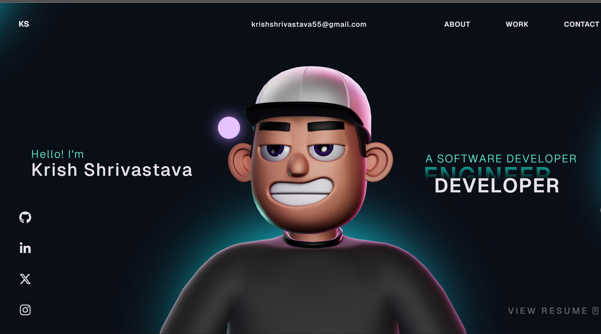

# 🚀 Krish Shrivastava Portfolio

<p align="center">
  
</p>

---

## 👨‍💻 About Me

Computer Science Engineering student with strong skills in Full Stack Development, Data Structures & Algorithms, and modern technologies. Passionate about building real-world applications and exploring AI.

---

## 🛠️ Tech Stack

* **Frontend:** React.js, TypeScript, HTML5, CSS3
* **Backend:** FastAPI, Node.js
* **Database:** MongoDB, MySQL
* **Tools:** Git, GitHub, Vercel
* **Core:** DSA (C++), Problem Solving

---

## ✨ Features

* Interactive UI with smooth animations
* Responsive design
* Custom cursor effects
* Project showcase

---

## 📂 Projects

### 🔹 Banking Management System

* Authentication system
* Fund transfer & transactions
* Dashboard with insights

### 🔹 DSA Problem Solving

* Strong grip on data structures
* C++ based solutions

---

## 📬 Contact

* 📧 Email: [krishshrivastava55@gmail.com](mailto:krishshrivastava55@gmail.com)
* 💻 GitHub: https://github.com/krish0912-mth
* 🔗 LinkedIn: https://www.linkedin.com/in/krish-shrivastav

---

## ⚡ Installation

```bash
git clone https://github.com/krish0912-mth/portfolio.git
cd portfolio
npm install
npm run dev
```

---

## 🚀 Deployment

Will be deployed soon on Vercel 🚀

---

⭐ Star this repo if you like it!
